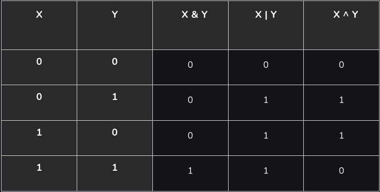

# **Embedded C**

Embedded C is a programming language that is used in the development of Embedded Systems. Embedded Systems are specialized systems designed to perform very specific functions or tasks. Embedded System is the combination of hardware and software, and the software is generally known as firmware which is embedded into the system hardware. Embedded C is used to program a wide range of microcontrollers and microprocessors. 

## Learn from Basic to Embedded

Even before touching microcontrollers, you can practice:

- Bitwise operations (&, |, <<, >>) → used for GPIO manipulation.

- Writing small C programs to simulate reading/writing registers.

- Use libraries like wiringPi (Linux) or GPIO sysfs to toggle Raspberry Pi pins (if you have Pi).

###  Bitwise operations

In the arithmetic-logic unit (which is within the CPU), mathematical operations like: addition, subtraction, multiplication and division are done in bit-level.  
In C, bitwise operators are used to perform operations directly on the binary representations of numbers. These operators work by manipulating individual bits (0s and 1s) in a number.

| Operators | Meaning of operators | Description |
|:----------|:--------------------:|:------------|
|     &     | Bitwise AND          | takes two numbers as operands and does AND on every bit of two numbers. The result of AND is 1 only if both bits are 1.   |
|     \|    | Bitwise OR           | takes two numbers as operands and does OR on every bit of two numbers. The result of OR is 1 if any of the two bits is 1. |
|     ^     | Bitwise XOR          | takes two numbers as operands and does XOR on every bit of two numbers. The result of XOR is 1 if the two bits are different. 
|     ~     | Bitwise complement (**NOT**)   | takes one number and inverts all bits of it. |
|     <<    | Shift left           | takes two numbers, the left shifts the bits of the first operand, and the second operand decides the number of places to shift.    **Formula**: x << y in equivalent to ` x * 2^y ` |
|     >>    | Shift right          | takes two numbers, right shifts the bits of the first operand, and the second operand decides the number of places to shift.    **Formula**: x >> y in equivalent to ` x / 2^y ` |

Read more:

  - [GeeksForGeeks](https://www.geeksforgeeks.org/c/bitwise-operators-in-c-cpp/)
  - [Programiz](https://www.programiz.com/c-programming/bitwise-operators)

#### **Table of bitwise operators**

